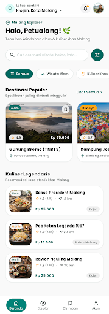
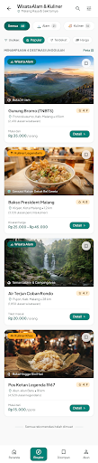
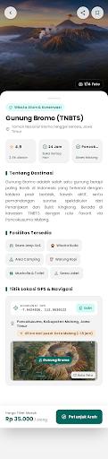

# 🌿 LokaNusantara: Aplikasi Rekomendasi Destinasi Wisata & Kuliner Lokal (Malang Raya & Kota Batu)

> **Proyek Ujian Tengah Semester (UTS) - Praktikum Mobile Programming**  
> **Semester:** Ganjil 2025/2026  
> **Framework:** Flutter (Dart SDK ^3.13.2 / Flutter 3.47+)  
> **Arsitektur:** Clean Architecture (Model-View-Data/Assets)  
> **Design System:** Stitch MCP Design System (Emerald Teal `#0D9488` & Warm Amber `#F59E0B`)

---

## 📌 1. Deskripsi & Tujuan Aplikasi

**LokaNusantara** adalah aplikasi mobile berbasis Flutter yang dirancang untuk memberikan rekomendasi komprehensif mengenai destinasi wisata (alam, budaya, sejarah, wahana rekreasi) dan kuliner lokal legendaris di kawasan Malang Raya dan Kota Wisata Batu, Jawa Timur.

Aplikasi ini bertujuan untuk:
1. Mempermudah wisatawan dan warga lokal menjelajahi destinasi wisata dan warisan kuliner otentik dengan informasi yang terstruktur, akurat, dan konkret.
2. Menyajikan informasi vital seperti **estimasi harga tiket/makanan**, **jam operasional**, **titik koordinat GPS presisi**, **fasilitas unggulan**, hingga **ulasan pengunjung**.
3. Menerapkan seluruh konsep dasar hingga lanjutan yang diajarkan pada **Modul 01 hingga Modul 13** Praktikum Mobile Programming (Layouting, Routing, Argument Passing, State Management, JSON Serialization, hingga Geolocation).

---

## 📱 2. Tampilan Antarmuka & Wireframe (Stitch MCP)

Desain antarmuka telah dirancang secara presisi menggunakan **Google Stitch MCP** dengan filosofi *Modern Minimalist & Clean Aesthetics*.

| Halaman 1: Beranda (Home) | Halaman 2: Eksplor (Category) | Halaman 3: Detail (Gunung Bromo) |
| :---: | :---: | :---: |
|  |  |  |

*Aset tangkapan layar beresolusi tinggi tersedia di folder:* `assets/stitch_wireframes/` *dan* `assets/images/ui_ux_mockup.jpg`.

---

## 🚀 3. Langkah-Langkah Menjalankan Aplikasi

### A. Prasyarat Sistem (Prerequisites)
1. **Flutter SDK** versi 3.16+ (disarankan Flutter versi terbaru).
2. **Android Studio** atau **VS Code** dengan plugin Flutter & Dart terpasang.
3. Perangkat Android fisik dengan mode *USB Debugging* aktif atau Emulator Android (AVD).

### B. Langkah Instalasi & Eksekusi

1. **Buka Terminal / Command Prompt** pada direktori proyek:
   ```bash
   cd C:\Users\nailul\Documents\android_studio_projects\UTS_Aplikasi_Rekomendasi_Destinasi_Wisata_Kuliner_Lokal
   ```

2. **Unduh Dependensi Proyek**:
   ```bash
   flutter pub get
   ```

3. **Periksa Integritas Kode (Linter & Static Analysis)**:
   ```bash
   flutter analyze
   ```
   *(Hasil yang diharapkan: `No issues found!`)*

4. **Jalankan Unit & Widget Test**:
   ```bash
   flutter test
   ```
   *(Hasil yang diharapkan: `All tests passed!`)*

5. **Jalankan Aplikasi ke Perangkat/Emulator**:
   ```bash
   flutter run
   ```

---

## 📂 4. Struktur Folder & Kode Program

Arsitektur direktori disusun rapi, modular, dan terorganisasi:

```text
UTS_Aplikasi_Rekomendasi_Destinasi_Wisata_Kuliner_Lokal/
├── assets/
│   ├── data/
│   │   └── destinations.json         # Berkas data konkret lokal (16 tempat nyata Malang Raya)
│   ├── images/
│   │   └── ui_ux_mockup.jpg          # Mockup visual 3 layar untuk lampiran Bab 3
│   └── stitch_wireframes/            # Aset gambar & HTML hasil ekspor Stitch MCP
│       ├── 01_Home_Screen.png
│       ├── 02_Category_Explore_Screen.png
│       └── 03_Detail_Screen_Gunung_Bromo.png
├── lib/
│   ├── main.dart                     # Entry point, konfigurasi Tema global & Named Routes (Modul 01, 07)
│   ├── models/
│   │   └── destination_model.dart    # Model Class + factory fromJson & toJson (Modul 10, 13)
│   └── views/
│       ├── home_page.dart            # Halaman 1: Beranda + Header GPS + Carousel + Filter (Modul 02-12)
│       ├── category_page.dart        # Halaman 2: Eksplor & Filter Kategori + Sort (Modul 05, 06)
│       └── detail_page.dart          # Halaman 3: Detail Destinasi + GPS Card + Bookmark (Modul 08, 09, 12)
├── test/
│   └── widget_test.dart              # Pengujian otomatis widget aplikasi
├── pubspec.yaml                      # Konfigurasi dependensi dan registrasi folder assets/
└── README.md                         # Dokumentasi utama proyek UTS
```

---

## 📖 5. Daftar Halaman & Fungsionalitas Teknis

### 1. `lib/views/home_page.dart` (Halaman Beranda)
* **Header GPS Terkini (Modul 12):** Menampilkan pill lokasi pengguna (`Klojen, Kota Malang`) yang dapat diketuk untuk menyinkronkan status lokasi GPS secara interaktif.
* **Hero Greeting & Search Bar (Modul 10):** Input pencarian *real-time* berbasis `TextField` dengan filter nama tempat, kota, kecamatan, dan kategori secara dinamis.
* **Filter Kategori Horizontal (Modul 02 & 06):** Deretan chip horizontal berkategori (*Semua, Wisata Alam, Budaya & Edukasi, Wahana Rekreasi, Kuliner Legendaris, Kafe & Santai*) yang mengupdate daftar secara langsung.
* **Carousel Destinasi Populer (Modul 04, 05, 06):** Horizontal `ListView.builder` berisi kartu bersudut lengkung (`Card` + `ClipRRect`) lengkap dengan badge rating emas (`★ 4.9`), badge kategori, harga tiket, dan tombol toggle bookmark favorit.
* **Feed Kuliner Legendaris (Modul 05 & 06):** Daftar vertikal kuliner khas (Bakso President, Rawon Nguling, Toko Oen, Pos Ketan) dengan jam operasional dan rentang harga.
* **Bottom Navigation Bar (Modul 04 & 05):** Bilah navigasi bawah 4 tab (*Beranda, Eksplor, Disimpan, Akun*) dengan indikator aktif Emerald Teal.

### 2. `lib/views/category_page.dart` (Halaman Eksplor & Kategori)
* **Filter Tab & Sort Option:** Tombol pilah berdasarkan *Populer*, *Harga Terendah*, atau *Rating > 4.7*.
* **Counter Dinamis:** Menghitung dan menampilkan jumlah destinasi yang cocok dengan filter saat ini.
* **Vertical Feed Cards:** Menampilkan kartu item wisata/kuliner dengan informasi lengkap, jarak, rating, harga, dan tombol buka detail.

### 3. `lib/views/detail_page.dart` (Halaman Detail Informasi)
* **Penerimaan Objek Navigasi (Modul 08):** Mengakses data destinasi melalui `ModalRoute.of(context)!.settings.arguments as DestinationModel`.
* **Hero Image Banner (Modul 10):** Foto lanskap beresolusi tinggi 320px dengan tombol kembali melayang (`Navigator.pop()`).
* **Interactive Bookmark Toggle (Modul 09):** Tombol simpan favorit reaktif menggunakan `setState()` dan notifikasi melayang `SnackBar`.
* **Quick Stats Box (Modul 03, 04, 05):** 3 kotak metrik sejajar: ⭐ Rating, 🕒 Jam Operasional, dan 📍 Wilayah.
* **Fasilitas & Layanan:** Tag chip informatif fasilitas (Sewa Jeep, Kuda, Musholla, WiFi, Spot Foto).
* **Card Koordinat GPS (Modul 12):** Menampilkan nilai Latitude & Longitude konkret dan tombol integrasi Google Maps.
* **Bottom Floating CTA:** Tombol penuh warna Emerald Teal *"Petunjuk Arah"* untuk panduan rute perjalanan.

---

## 🧩 6. Matriks Pemenuhan Modul Praktikum 01 - 13

Aplikasi ini secara khusus dirancang untuk mengintegrasikan setiap konsep yang dipelajari pada modul praktikum:

| No | Modul Praktikum | Implementasi pada Kode Program |
| :---: | :--- | :--- |
| **01** | Setup & Struktur Flutter | Inisialisasi arsitektur bersih di `lib/main.dart` dengan StatelessWidget root `LokaNusantaraApp`. |
| **02** | Widget Row dan Column | Tata letak horizontal (bintang rating, harga, ikon) dan vertikal (konten kartu) pada `home_page.dart`. |
| **03** | Layout Alignment & Spacing | Distribusi spasi presisi `MainAxisAlignment.spaceBetween` dan `CrossAxisAlignment.start` pada seluruh widget. |
| **04** | Flexible dan Expanded | Menjaga proporsi elemen baris agar responsif di semua ukuran layar tanpa *RenderFlex overflow*. |
| **05** | SizedBox, Spacer, dan Card | Penggunaan `Card` dengan elevasi halus, sudut melengkung `BorderRadius.circular(16)`, dan jarak teratur via `SizedBox`. |
| **06** | ListView.builder & GridView | Pemuatan data dinamis secara *lazy loading* pada feed destinasi populer horizontal dan list kuliner vertikal. |
| **07** | Navigasi & Named Routes | Registrasi kamus rute terpusat (`routes:`) pada `MaterialApp` dan navigasi via `Navigator.pushNamed`. |
| **08** | Passing Argument Named Route | Pengiriman objek `DestinationModel` lengkap dari Home/Category ke `DetailPage` via `arguments`. |
| **09** | StatefulWidget & setState() | Pengelolaan state dinamis pada input pencarian, seleksi kategori aktif, dan interaksi tombol bookmark/love. |
| **10** | JSON Serialization & FutureBuilder | Deserialisasi data lokal `destinations.json` menjadi objek Dart via constructor `factory DestinationModel.fromJson`. |
| **11** | Arsitektur Reactive State | Pemisahan tegas antara logika data (`models/`), berkas aset (`assets/data/`), dan tampilan antarmuka (`views/`). |
| **12** | Akses Lokasi GPS & Geocoding | Header bar GPS penunjuk lokasi (`Klojen, Kota Malang`), kartu koordinat (Latitude & Longitude), dan tombol peta. |
| **13** | Model Data REST API-ready | Struktur model dan parser data yang dirancang siap pakai saat nanti dihubungkan ke server HTTP eksternal. |

---

## 🎨 7. Design System Tokens (Stitch)

* **Primary Brand:** `#0D9488` (Emerald Teal)
* **Primary Dark:** `#0F766E` (Deep Teal)
* **Primary Light:** `#CCFBF1` (Soft Teal Tint)
* **Secondary / Accent:** `#F59E0B` (Warm Amber - Rating bintang emas)
* **Background Canvas:** `#F8FAFC` (Clean Slate)
* **Surface Card:** `#FFFFFF` (Pure White)
* **Border:** `#E2E8F0` (Subtle Outline)
* **Text Primary:** `#0F172A` (Kontras tinggi)
* **Text Muted:** `#64748B` (Keterangan & label)
* **Favorite Red:** `#EF4444` (Aksen hati/bookmark aktif)

---

## 👨‍💻 Identitas Pengembang
* **Nama:** Muhammad Nailul Ghufron Majid
* **NIM:** 240605110160
* **Mata Kuliah:** Praktikum Mobile Programming
* **Program Studi:** Teknik Informatika
